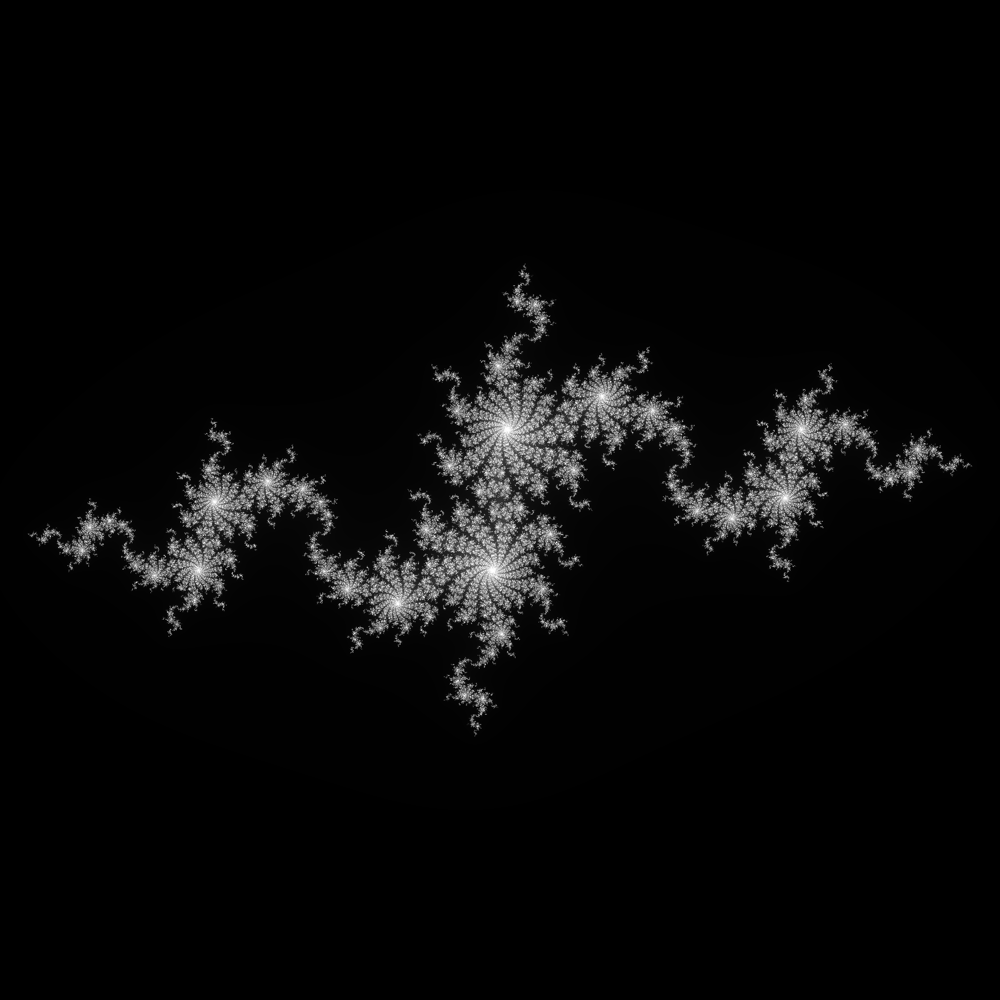

# Julia Set by CUDA


A simple multi-thread CUDA program which generates the density map of [Julia set](https://en.wikipedia.org/wiki/Julia_set) for

<p align="center">
    
</p>

To plot `.png` file, you should first compile the main CUDA program through `cmake`, please check `run.sh`. The library to plot `.png` is taken from [stb](https://github.com/nothings/stb).
```bash
./run.sh
```
You may modify some important parameters like iteration depth and xy range, please check `julia.cu`.

