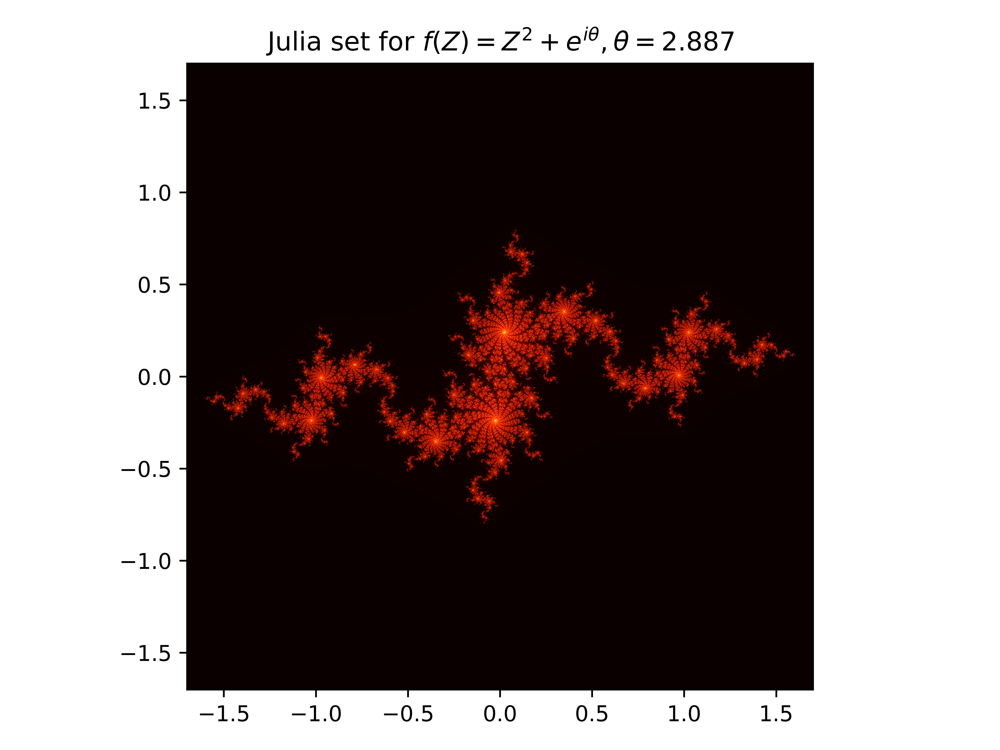

# Julia Set by CUDA


A simple multi-thread cuda program which generate the density map of [Julia set](https://en.wikipedia.org/wiki/Julia_set) for

<p align="center">
    
</p>

To plot `.png` file, you should first compile the main cuda program through make and then plot the density map using python (please ensure that numpy and matplotlib are installed).
```bash
make run # or make && ./julia
python plot.py
```
You may modify some important parameters like iteration depth and xy range, please check `julia.cu`.


